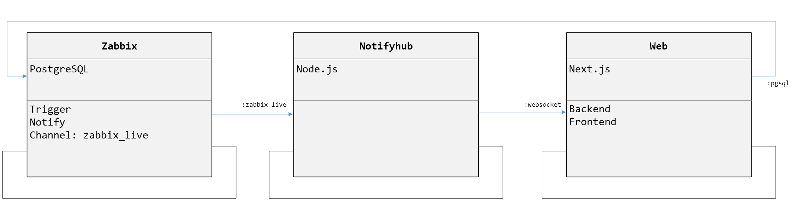
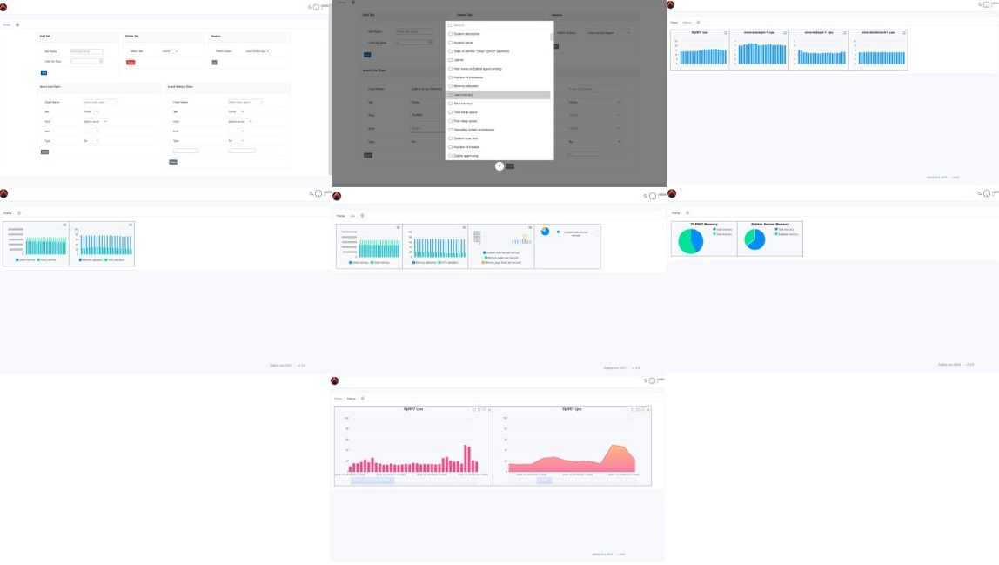

# Zabbix-live

Zabbix complementary system for live metric monitoring.

**1. Zabbix**

    Database: Uses PostgreSQL to store monitoring data.

    Triggers and Notifications: Zabbix monitors systems and generates triggers based on conditions. When triggers are activated, notifications are sent.

    Channel: Notifications are published to a PostgreSQL channel named zabbix_live, enabling external components to listen for real-time updates.

**2. NotifyHub**

    Technology: Built using Node.js.
    
    Purpose: Acts as a bridge between Zabbix and the Web client. It listens to the zabbix_live channel from the Zabbix PostgreSQL database, processes the notifications, and forwards them in real time by discriminating monitored sensor item.
    
    Communication: Sends updates to the Web component through WebSockets.

**3. Web**

    Technology: Developed using Next.js, providing both backend and frontend functionalities.
    
    Backend: Processes incoming WebSocket messages from NotifyHub and manages additional API requests or database queries, if needed.
    
    Frontend: Displays real-time data to users, received from the backend. Simpla dashboard creation.

## Installation

1. Install Zabbix Postgresql Components [README](pgsql/README.md)

2. Install Notifyhub server [README](notifyhub/README.md)

3. Install Zabbix-live Web Server [README](web/README.md)

## Screenshots

## TODO

1. ~~Pie chart~~ [06.01.2025]

2. Multiple Item Selection - individual charts

3. ~~Multiple Item Selection - combined chart~~ [06.01.2025]

4. Network map display

